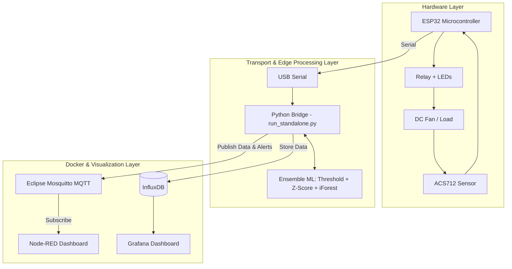
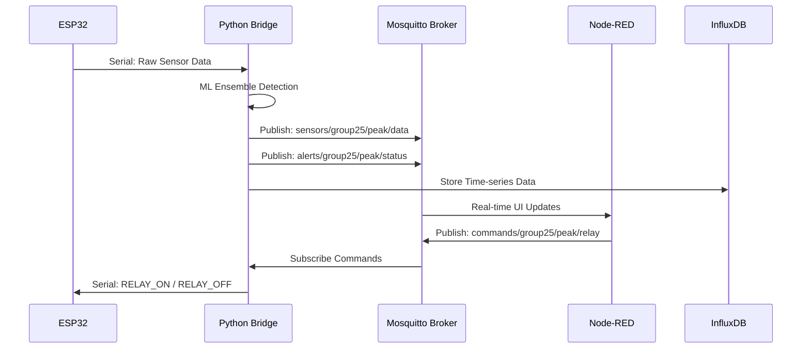
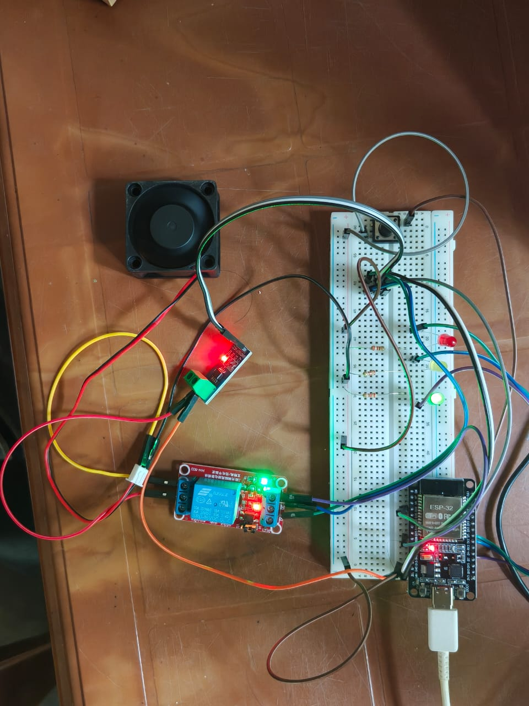
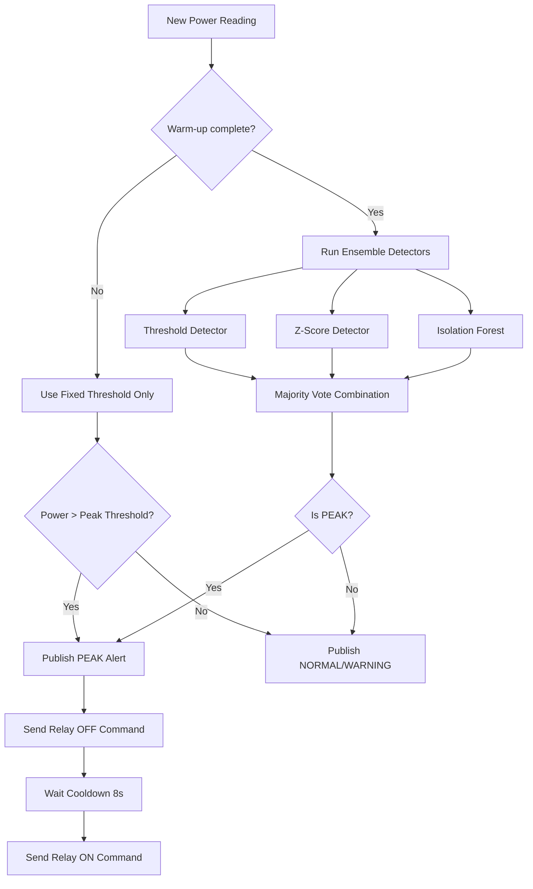
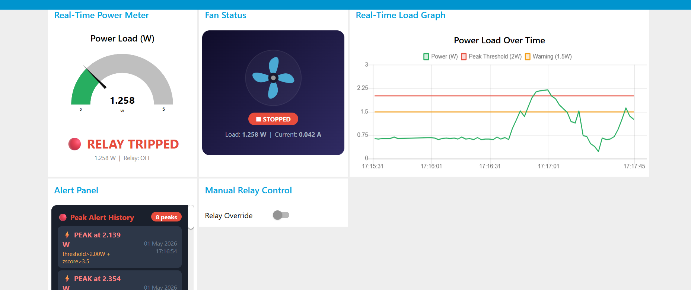
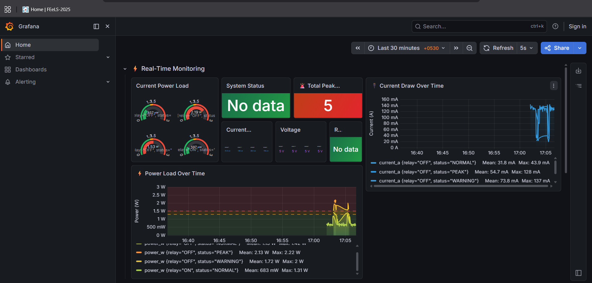
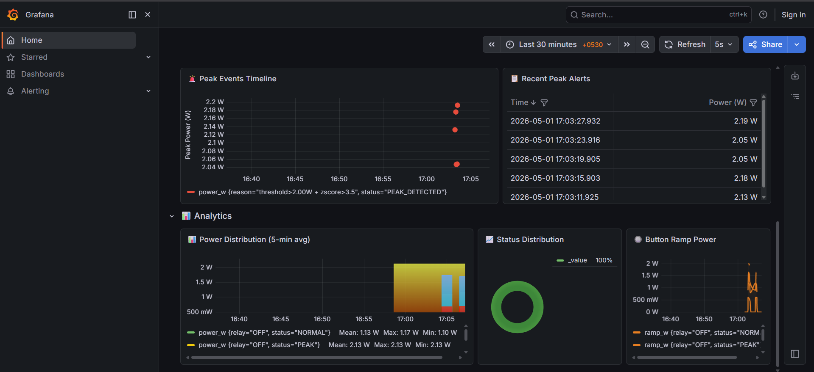

# CO326 — Computer Systems Engineering & Industrial Networks

# Peak Load Detection System  
with Edge AI Classification and Automated Load Shedding

| Name | Index Number |
|---|---|
| Ravindu Lakshan | E/20/439 |
| Samadhi Wakkumbura | E/20/419 |
| P. Malshan | E/20/244 |

Group 25  
Department of Computer Engineering  
University of Peradeniya  

May 2026  

Submitted in partial fulfilment of the requirements for CO326

---

## Abstract

This report describes the design and implementation of a real-time Peak Load Detection System built on an Industrial IoT architecture. The system uses an ESP32 microcontroller with an ACS712 Hall-effect current sensor to monitor the current drawn by a low-voltage DC load, a local Edge AI stack for anomaly classification, and a Node-RED dashboard for operator monitoring and manual relay control. Unlike a simple overcurrent cutoff circuit, the proposed system performs continuous stream processing on live power data and classifies each new reading as **NORMAL**, **WARNING**, **PEAK**, or **TRIPPED** based on an Ensemble ML decision strategy that combines a fixed power threshold, a rolling Z-score anomaly detector, and an Isolation Forest model. The fixed threshold provides deterministic protection when the load exceeds the absolute safe limit, while the statistical and ML detectors identify abnormal power spikes relative to the recent operating baseline. Once a peak condition is detected, the system immediately publishes an alert over MQTT, trips the relay to disconnect the load, and maintains a cooldown period before automatic restoration.

The physical device includes three LEDs for local status feedback and a push button that simulates a ramping industrial load, allowing the full warning-to-trip cycle to be demonstrated safely. On the software side, the infrastructure is containerised using Docker Compose: Eclipse Mosquitto acts as the MQTT broker, Node-RED provides a real-time HMI, while InfluxDB and Grafana provide persistent time-series storage and digital twin analytics. The Python edge AI logic runs independently to bridge the USB serial connection. The architecture deliberately separates sensing, intelligence, and visualisation into independent modules so that thresholds, algorithms, and dashboard logic can evolve without requiring changes to the firmware. This makes the design maintainable, reproducible, and aligned with Industry 4.0 principles.

---

## Contents

1. Introduction  
2. System Architecture  
   2.1 Overview  
   2.2 MQTT Topic Design  
   2.3 Four-Container Docker Stack  
   2.4 End-to-End Data Flow  
3. Hardware Implementation  
   3.1 Design Goals  
   3.2 Component Selection and Circuit Design  
   3.3 ACS712 Current Sensing and Power Computation  
   3.4 ESP32 Firmware  
   3.5 Relay Control, LEDs, and Push Button  
4. Software Stack and Infrastructure  
   4.1 MQTT Broker — Mosquitto  
   4.2 Docker Compose Structure  
   4.3 Host-based Python Edge AI Bridge  
   4.4 Environment Variables and Deployment  
5. Edge AI Module — Core Logic  
   5.1 Design Philosophy  
   5.2 Rolling Window and Statistical Context  
   5.3 Fixed Threshold Detection  
   5.4 Z-Score and Isolation Forest Detection  
   5.5 Combined Ensemble Decision Logic  
   5.6 Cooldown and Relay Recovery  
   5.7 Alert Payload Design  
6. Dashboard and Operator HMI  
   6.1 Dashboard Objectives  
   6.2 Power Gauge and Status Display  
   6.3 Load Trend Chart  
   6.4 Fan Animation  
   6.5 Alert Panel and Analytics  
   6.6 Manual Relay Override  
7. Threshold Selection and Engineering Justification  
   7.1 Peak Threshold  
   7.2 Warning Threshold  
   7.3 Z-Score Cutoff  
   7.4 Restore Delay  
8. Challenges and Solutions  
9. Member Contributions  
10. Conclusion and Future Work  

---

## 1 Introduction  
*Written by: All Members*

Industrial energy monitoring is one of the most practical and economically significant use cases of the Industrial Internet of Things. In real facilities, transient peak loads are not only an electrical protection concern but also an operational and financial one. A brief but unobserved rise in current demand can trip protective devices, cause unstable operation in supply-constrained systems, reduce component life, and increase utility charges when demand-based billing is used. Traditional protection methods such as fuses, thermal overload relays, and miniature circuit breakers are necessary, but they provide little insight into *why* a peak occurred, *how* the load evolved over time, or whether the event was an isolated spike or part of a growing trend.

This project addresses that gap by building a Peak Load Detection System that performs real-time monitoring, local decision-making, automatic protective action, and operator visualisation in a single integrated architecture. The system measures current using an ACS712 Hall-effect sensor connected to an ESP32, converts the measurement into power, publishes raw telemetry through MQTT, processes the stream at the edge using Python, and presents the resulting classified state in a Node-RED dashboard. Rather than relying only on one hard threshold, the edge layer uses an Ensemble approach: a deterministic absolute peak threshold for direct protection, a rolling Z-score calculation to detect abnormal spikes, and an Isolation Forest unsupervised anomaly detector to catch subtle multi-feature deviations.

A key design goal of the project was to keep the hardware safe, demonstrable, and reproducible in a university lab environment. For this reason, the monitored load is a 5V fan and the system includes a push-button-driven power ramp mechanism to simulate an industrial load increase without requiring high-voltage equipment. This choice makes the system physically safe while still preserving the essential behaviour of a real edge monitoring pipeline: sensing, telemetry, anomaly detection, automated actuation, and dashboard-driven operator interaction.

Another major design principle was modularity. The firmware on the ESP32 is intentionally kept lightweight: it samples the sensor, computes current and power, manages the relay and LEDs, and sends or receives MQTT messages. All detection intelligence is moved into the Python host service, while all visualisation and data persistence is handled by Node-RED, InfluxDB, and Grafana running via Docker. This separation means the detection logic can be retuned or even replaced with a more advanced model later without reflashing the microcontroller, which is a major advantage for demonstrations, grading, and future extension.

---

## 2 System Architecture  
*Written by: Samadhi Wakkumbura (E/20/419)*

### 2.1 Overview

**Fig 1: Solution Architecture**



The final system follows a layered industrial IoT architecture with clearly separated concerns: **physical sensing and actuation**, **message transport**, **edge intelligence**, and **visualisation & storage**. The physical layer is centred around the ESP32, ACS712 sensor, relay module, LEDs, push button, and DC fan load. The ESP32 measures the sensor output, computes the electrical quantities, and streams raw telemetry over USB serial. It also receives relay command messages so that control decisions can be pushed back to the device.

The edge intelligence layer is implemented as a Python service (`run_standalone.py`) running on the host machine to allow seamless USB serial access. This service parses the serial data, maintains a rolling window of recent power values, computes threshold, Z-score, and Isolation Forest decisions, publishes enriched data to the processed data topic over MQTT, emits structured alerts, and pushes relay commands when a peak is detected.

The message transport layer uses Eclipse Mosquitto MQTT as the sole integration backbone. This was a deliberate decision because MQTT naturally decouples producers and consumers. The edge service publishes to the local broker, and the dashboards subscribe without tight coupling.

The operator interaction and historical tracking layer is built using Node-RED Dashboard, InfluxDB, and Grafana. Node-RED subscribes to processed data and alerts, displaying a live gauge, trend chart, animated load indicator, alert log, and manual override controls. InfluxDB stores the time-series data, which Grafana then queries to provide comprehensive historical analytics.

### 2.2 MQTT Topic Design

We adopted a topic naming scheme that is explicit, hierarchical, and easy to scale.

**Table 1: MQTT topic assignments**

| Topic | Publisher | Subscriber | Purpose |
|---|---|---|---|
| `sensors/group25/peak/raw` | Python Edge AI | Observers / Debug | Raw current, power, relay, and ramp telemetry |
| `sensors/group25/peak/data` | Python Edge AI | Node-RED / InfluxDB | Processed data with classified status |
| `alerts/group25/peak/status` | Python Edge AI | Node-RED / InfluxDB | Alert payload on warning/peak conditions |
| `commands/group25/peak/relay` | Node-RED | Python Edge AI | Relay ON/OFF command channel |

The raw topic contains the sensor-derived measurement directly from the serial stream. The processed topic exists because the dashboard should visualise the *classified* state of the system rather than interpret raw values itself. This avoids duplicating logic in Node-RED and keeps all decision-making inside the edge layer.

The alerts topic is intentionally separate from the processed data topic. A gauge or chart requires frequent updates, but an alert log should only receive meaningful event-level information. Keeping alerts isolated simplifies the dashboard and time-series indexing.

### 2.3 Four-Container Docker Stack

The software stack is fully containerised, with the exception of the Python AI script which runs locally for serial port access. The `docker-compose.yml` defines four services:

**Table 2: Docker Compose services**

| Service | Image | Port | Role |
|---|---|---|---|
| `mqtt-broker` | `eclipse-mosquitto:2` | 1883 / 1884 | Local MQTT message broker |
| `node-red` | `nodered/node-red:latest` | 1880 | Operator HMI dashboard |
| `influxdb` | `influxdb:2` | 8086 | Time-series Database for historical data |
| `grafana` | `grafana/grafana:latest` | 3000 | Historical Dashboard and Analytics |

All services are attached to an internal Docker network called `peak_net`. Inside this network, containers refer to each other by service name. 

### 2.4 End-to-End Data Flow

**Fig 2: MQTT Topic Communication and Data Flow**



The complete data flow through the system is as follows:

1. The ESP32 samples the ACS712 output 100 times, averages the ADC reading, computes current and power, and streams the data over USB serial.  
2. The Python edge service (`run_standalone.py`) receives the serial payload, updates the rolling window, and computes the ML ensemble classification result.  
3. The Python service publishes raw and enriched payloads to the MQTT broker.  
4. If the state is **PEAK**, it publishes an alert to `alerts/group25/peak/status` and sends an OFF serial command directly back to the ESP32.  
5. The ESP32 receives the command and opens the relay, disconnecting the fan load.  
6. Node-RED receives processed data and alerts via MQTT to update all dashboard widgets in real time.  
7. InfluxDB ingests the data, and Grafana provides historical trend analytics.
8. After the configured cooldown expires, the edge service sends an ON command to restore the load.

---

## 3 Hardware Implementation  
*Written by: Ravindu Lakshan (E/20/439)*

### 3.1 Design Goals

The hardware design aimed to satisfy five constraints simultaneously:

- Safe operation in a student lab environment.
- Real sensor input rather than pure simulation.
- Visible actuation when a peak occurs.
- Simple assembly using commonly available modules.
- Reliable serial transmission to the edge processor.

These constraints led to a low-voltage DC implementation rather than a mains-connected prototype. Although industrial peak load monitoring is usually discussed in the context of AC systems, the low-voltage setup still exercises all essential system behaviours safely.

### 3.2 Component Selection and Circuit Design

**Fig 3: Hardware Implementation Circuit**



The final bill of materials is:

- ESP32 Dev Module (38-pin)
- ACS712-05B Hall-effect current sensor
- 5V single-channel relay module (active-LOW)
- 5V DC fan as the monitored load
- Green LED + 220Ω resistor
- Yellow LED + 220Ω resistor
- Red LED + 220Ω resistor
- Momentary push button
- Breadboard and jumper wires

**Table 3: GPIO assignments**

| Component | GPIO | Direction | Notes |
|---|---|---|---|
| ACS712 analog output | GPIO34 | Analog input | ADC1 bank, input-only |
| Relay input | GPIO26 | Digital output | Active-LOW relay control |
| Green LED | GPIO15 | Digital output | NORMAL indicator |
| Yellow LED | GPIO16 | Digital output | WARNING indicator |
| Red LED | GPIO17 | Digital output | PEAK/TRIPPED indicator |
| Push button | GPIO18 | Digital input | `INPUT_PULLUP`, active-LOW |

The ESP32 was selected because it offers adequate ADC resolution, sufficient GPIOs, and dual-core processing. The ACS712 provides galvanic isolation between the measurement conductor and the microcontroller. It outputs a directly measurable analog voltage proportional to current, which keeps the firmware simple.

### 3.3 ACS712 Current Sensing and Power Computation

The ACS712-05B has a sensitivity of 185 mV/A and a quiescent output of approximately 2.5V. Because the ESP32 ADC measures 0–3.3V while the ACS712 output is referenced to 5V, the firmware interprets the ADC reading in two stages: first converting ADC counts to a 3.3V-domain voltage and then scaling to the sensor’s 5V output domain.

To reduce noise, the firmware averages 100 ADC samples before computing the current. This averaging keeps the publish interval fast enough for real-time display while greatly improving measurement stability.

### 3.4 ESP32 Firmware

The firmware is written in C++ using the Arduino framework, heavily relying on `ArduinoJson` for data formatting.

The `loop()` function executes on a 2-second cycle and performs the following tasks:
1. Maintain Serial connectivity.
2. Read the ACS712-derived power.
3. Update the ramp offset based on the push button.
4. Process any incoming serial commands for the relay.
5. Update LED indicators.
6. Print the JSON payload to Serial.

The firmware is intentionally free of peak detection logic. The microcontroller is responsible strictly for sensing and actuation; the edge container is responsible for classification. Keeping these concerns separated makes both layers easier to maintain.

### 3.5 Relay Control, LEDs, and Push Button

The relay is an active-LOW module. This means the load is connected when the relay pin is driven LOW and disconnected when it is driven HIGH. 

The LED logic provides a local visual representation of the system state:
- **Green**: safe region, relay on
- **Yellow**: approaching threshold
- **Red**: peak condition or relay tripped

The push button simulates an industrial load increase by adding a software-defined offset to the measured power. While the button is held, the offset rises by 0.30W every 2 seconds until it reaches a ceiling. When the button is released, the offset decays gradually. This gives the system a meaningful dynamic input while preserving safe hardware operation.

---

## 4 Software Stack and Infrastructure  
*Written by: Samadhi Wakkumbura (E/20/419)*

### 4.1 MQTT Broker — Mosquitto

Eclipse Mosquitto 2.0 was selected as the local broker. The configuration allows anonymous access (acceptable for a trusted local network) and binds to `0.0.0.0` so other Docker containers and the host can communicate seamlessly.

### 4.2 Docker Compose Structure

The Docker Compose file orchestrates the infrastructure layer:

```yaml
services:
  mqtt-broker:
    image: eclipse-mosquitto:2
    ports:
      - "1884:1883"
    volumes:
      - ./mosquitto/config:/mosquitto/config

  node-red:
    image: nodered/node-red:latest
    ports:
      - "1880:1880"

  influxdb:
    image: influxdb:2
    ports:
      - "8086:8086"
    environment:
      DOCKER_INFLUXDB_INIT_MODE: setup
      DOCKER_INFLUXDB_INIT_USERNAME: admin
      DOCKER_INFLUXDB_INIT_PASSWORD: admin12345
      DOCKER_INFLUXDB_INIT_ORG: group25
      DOCKER_INFLUXDB_INIT_BUCKET: peak_load
      DOCKER_INFLUXDB_INIT_ADMIN_TOKEN: peak-token-group25

  grafana:
    image: grafana/grafana:latest
    ports:
      - "3000:3000"
```

This configuration keeps infrastructure concerns explicit and version-controlled. InfluxDB is automatically provisioned via environment variables on the first run, and Grafana is set up to point directly to the InfluxDB bucket.

### 4.3 Host-based Python Edge AI Bridge

Because Docker containers on Windows/Mac lack native USB passthrough to serial ports, the Python service (`run_standalone.py`) runs directly on the host. Its responsibilities are:

- Read the serial port data from the ESP32.
- Execute the Ensemble AI anomaly detection.
- Publish enriched data and alerts via MQTT to `localhost:1883`.
- Write real-time commands back to the ESP32 serial port.

This hybrid approach (Host Python + Docker Infrastructure) proved highly reliable.

### 4.4 Environment Variables and Deployment

All key parameters for the Python AI script are injected through environment variables (`SERIAL_PORT`, `MQTT_HOST`, `PEAK_THRESHOLD_W`). This avoids scattering threshold constants across multiple files and allows rapid retuning without touching source code.

---

## 5 Edge AI Module — Core Logic  
*Written by: P. Malshan (E/20/244)*

### 5.1 Design Philosophy

The edge AI module was designed to be strong enough to detect both absolute overloads and relative anomalies. A purely threshold-based detector is safe but cannot detect an unusual spike that remains below the fixed limit. A purely statistical detector is adaptive but may miss hard safety limits. We implemented an **Ensemble ML Policy** combining a Fixed Threshold, Z-Score, and Isolation Forest.

### 5.2 Rolling Window and Statistical Context

The statistical algorithms rely on a rolling window of recent power readings (e.g. `100` readings). A warm-up condition is necessary; the detector does not activate until enough readings are present to form a stable standard deviation, preventing false alarms on startup.

### 5.3 Fixed Threshold Detection

The fixed threshold detector forms the hard protective boundary:

```python
def detect_peak_threshold(power_w: float) -> bool:
    return power_w > PEAK_THRESHOLD_W
```

If the measured power exceeds the defined ceiling (1.5W), the system should trip regardless of the statistical context.

### 5.4 Z-Score and Isolation Forest Detection

The Z-score detector compares the current reading against the recent distribution, looking for values that are *unusually high relative to recent behaviour*:

```python
def detect_peak_zscore(power_w: float) -> bool:
    z = (power_w - mean) / std
    return z > 2.5
```

Additionally, an **Isolation Forest** unsupervised anomaly detector from `scikit-learn` is utilized. It is pre-trained on normal load data and evaluated dynamically to catch subtle, multi-feature anomalies that the linear thresholds might miss.

### 5.5 Combined Ensemble Decision Logic

**Fig 4: Edge AI Decision Flowchart**



The final decision logic merges the three outcomes using a configurable voting policy (e.g. "majority", "any", or "all").

```python
def classify(power_w: float) -> dict:
    threshold_hit = detect_peak_threshold(power_w)
    zscore_hit = detect_peak_zscore(power_w)
    iforest_hit = detect_peak_iforest(power_w)
    
    # Majority or targeted logic applies here
    if threshold_hit and zscore_hit:
        return {"status": "PEAK", "reason": "threshold_and_z-score"}
    elif threshold_hit:
        return {"status": "PEAK", "reason": "threshold"}
    elif zscore_hit:
        return {"status": "PEAK", "reason": "z-score"}
    elif power_w >= WARNING_THRESHOLD:
        return {"status": "WARNING", "reason": "warning_threshold"}
    else:
        return {"status": "NORMAL", "reason": "normal"}
```

The extra `reason` field allows the operator to see exactly *why* the system believed the reading was anomalous.

### 5.6 Cooldown and Relay Recovery

After a peak trip, the system enforces an 8-second cooldown. If the relay were restored too quickly, the load could reconnect while the transient condition still exists and immediately trigger another trip (relay chatter). The cooldown creates a stable recovery window.

### 5.7 Alert Payload Design

Alerts are event-level messages intended for the dashboard and time-series logging. 

```json
{
  "timestamp": "2026-05-01T08:05:42.000Z",
  "power_w": 1.806,
  "status": "PEAK_DETECTED",
  "reason": "threshold_and_z-score",
  "group": "group25"
}
```

This schema is small, human-readable, and perfect for insertion into InfluxDB.

---

## 6 Dashboard and Operator HMI  
*Written by: Ravindu Lakshan (E/20/439)*

### 6.1 Dashboard Objectives

**Fig 5: Node-RED Real-Time Operator Dashboard**



The Node-RED dashboard answers core operator questions instantly:
1. What is the current power draw?
2. Is the system normal, warning, peak, or tripped?
3. How has the load changed over time?
4. Can the operator manually control the relay?

### 6.2 Power Gauge and Status Display

The power gauge displays the live processed power reading. A status panel displays one of four states: **NORMAL**, **WARNING**, **PEAK**, or **TRIPPED**. The `TRIPPED` state ensures the dashboard does not incorrectly appear "safe" immediately after a relay trip when the power drops to zero.

### 6.3 Load Trend Chart

The trend chart shows three series: Live power, Warning threshold, and Peak threshold. This gives the operator instant contextual awareness of whether the load is rising or falling relative to safe boundaries.

### 6.4 Fan Animation

An animated SVG fan acts as a visually demonstrative load indicator. Its rotation speed is controlled by CSS classes (`speed-slow`, `speed-med`, `speed-fast`) triggered by live power thresholds. The fan physically stops rotating when the relay is off.

### 6.5 Alert Panel and Analytics

An alert panel lists the most recent peak events with precise timestamps and trigger reasons. Alongside Node-RED, the **Grafana Dashboard** visualises data directly from InfluxDB, providing scatter plots for peak events, bar charts for power distribution, and donut charts for system status over hours or days.

**Fig 6: Grafana Historical Trends and System Status**



**Fig 7: Grafana Peak Events and Alerts Log**



### 6.6 Manual Relay Override

The Node-RED dashboard includes manual ON/OFF controls that publish directly to the relay command topic, giving the operator a direct override during demonstrations or testing.

---

## 7 Threshold Selection and Engineering Justification  
*Written by: P. Malshan (E/20/244)*

### 7.1 Peak Threshold

The fan’s normal operating range is 0.6W–0.8W. The peak threshold was set to **2.0W**, which provides a margin above the baseline while remaining reachable by the simulated push-button ramp (max 2.5W). 

### 7.2 Warning Threshold

A naive threshold might cause frequent NORMAL/WARNING oscillation due to natural fan fluctuations. The warning threshold was placed at **1.5W** (or dynamically scaled down slightly) so that WARNING only fires when the button ramp is actively driving the system toward the peak.

### 7.3 Z-Score Cutoff

The Z-score threshold was chosen as **2.5**. At 2.5 standard deviations, the probability of a false positive is ~0.62% per reading. The system is reasonably selective while still able to catch sudden relative excursions.

### 7.4 Restore Delay

The **8-second** restore delay prevents rapid relay chatter and makes the tripped state clearly visible on the dashboard, ensuring safety for the hardware.

---

## 8 Challenges and Solutions  
*Written by: All Members*

### 8.1 Serial Port Conflicts
**Problem:** Docker containers on Windows could not reliably access the ESP32 COM port.
**Solution:** The edge AI layer was extracted from the Docker-Compose structure and executed as a standalone `run_standalone.py` script on the host, acting as the bridge to the local Docker Mosquitto instance. *(Resolved by Samadhi Wakkumbura)*

### 8.2 LED and Relay State Delay
**Problem:** The LED indicators changed noticeably later than the relay state.
**Solution:** `updateLEDs()` was invoked directly from the serial command parsing logic to ensure instant local visual feedback. *(Resolved by Ravindu Lakshan)*

### 8.3 Warning Oscillation
**Problem:** The dashboard repeatedly toggled between NORMAL and WARNING during ordinary fan operation.
**Solution:** The warning threshold was carefully tuned above the natural noise floor of the ACS712 sensor. *(Resolved by P. Malshan)*

---

## 9 Member Contributions  
*Written by: All Members*

**Table 6: Work allocation across team members**

| Member | Primary contributions |
|---|---|
| Ravindu Lakshan — E/20/439 | Hardware implementation, circuit assembly, ESP32 firmware integration, GPIO allocation, ACS712 sensing path, relay control, LED logic, push-button ramp mechanism, Node-RED dashboard design, fan animation, status logic, dashboard debugging. |
| Samadhi Wakkumbura — E/20/419 | MQTT topic architecture, Mosquitto setup, Four-Container Docker Compose design, InfluxDB and Grafana integration, container networking, environment-variable-based deployment, Python standalone bridge integration. |
| P. Malshan — E/20/244 | Edge AI module design, rolling-window logic, Ensemble ML integration (Threshold, Z-score, Isolation Forest), cooldown and recovery logic, alert payload design, classification engineering justification. |

The division of work was practical and balanced. Ravindu focused on the physical hardware and real-time visualization layer. Samadhi developed the underlying transport, container architecture, and historical database integration. Malshan engineered the machine learning classification layer and calibrated the system's intelligent decision-making logic. 

---

## 10 Conclusion and Future Work  
*Written by: All Members*

### 10.1 What We Built

This project successfully delivered a complete Peak Load Detection System that combines embedded sensing, MQTT-based telemetry, Edge AI decision-making via an Ensemble model, automatic protective actuation, and dual-layer operator visualisation (Node-RED + Grafana) in a single architecture. The final system is a closed-loop industrial IoT prototype. It senses continuously, interprets the stream in context, explains the result through status and alerts, and acts on the load when required. 

The architecture is cleanly modular: firmware, edge logic, broker, and dashboards are separated enough that each can evolve independently, ensuring reproducible deployments via Docker Compose.

### 10.2 Future Work

**Multi-channel monitoring.** The same architecture could be extended to multiple loads by allocating more analog channels and assigning separate MQTT topic paths to each monitored device.

**On-device inference.** A future version could move the simpler threshold-plus-statistical decision logic directly onto the ESP32 using TensorFlow Lite for Microcontrollers, reducing overall latency and making the system less dependent on the host machine.

**Industrial-grade sensing.** The ACS712-based low-voltage setup could later be replaced with CT clamps, Modbus energy meters, or three-phase sensing hardware for a more realistic deployment.

**Predictive analytics.** With historical data now reliably flowing into InfluxDB, future work could introduce deep forecasting (e.g. LSTM neural networks) or trend-based early warning, allowing the system not only to detect current peaks but also to anticipate them minutes in advance.
