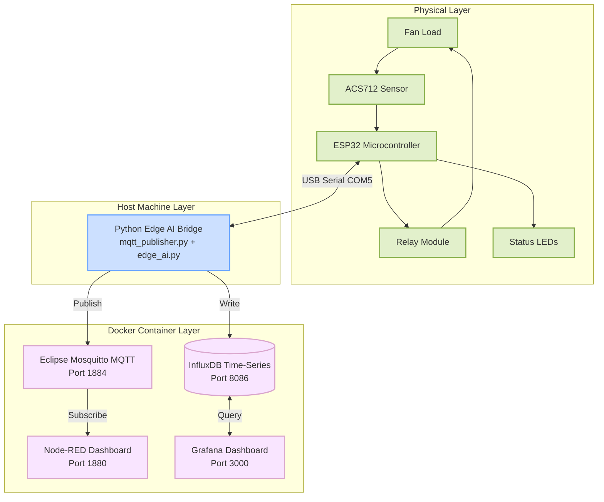
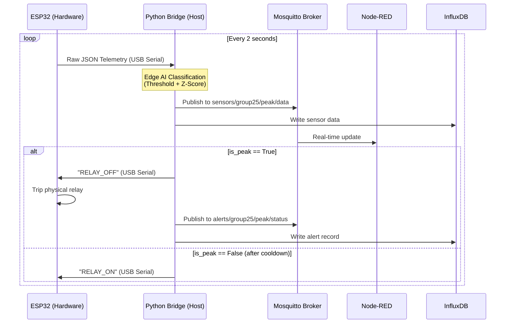

# Project Report Corrections Guide

This document contains the exact text and diagrams you need to update in your project report to accurately reflect the final, fully-working system. 

> [!IMPORTANT]
> The architecture changed significantly from the initial design. The ESP32 no longer uses WiFi to send MQTT messages. Instead, it uses a stable USB Serial connection to the host PC. The host PC runs the Edge AI Python bridge, which then pushes data to the Docker containers (MQTT, Node-RED, InfluxDB, Grafana). 

---

## 1. Diagram Updates (Mermaid Code)

You will need to replace your existing architecture diagrams with these updated versions. You can render these using a tool like [Mermaid Live Editor](https://mermaid.live/) and paste the resulting images into your report.

### Fig 1: Solution Architecture

Replace the old Fig 1 description and diagram with this:



### Fig 2: Communication and Data Flow

Replace the old Fig 2 (MQTT Topic Architecture) diagram with this:



---

## 2. Text Replacements

Copy the **Replacement** text and paste it over the corresponding sections in your original report.

### Section 2 — System Overview

**Replacement:**
> - **Physical Layer:** Fan (load) → ACS712 Sensor → ESP32 → Relay + LEDs
> - **Transport Layer:** USB Serial (COM5) → Python Bridge on host → Eclipse Mosquitto MQTT broker (Docker container, external port 1884)
> - **Edge AI Layer:** Python `mqtt_publisher.py` + `edge_ai.py` running on the host machine (not in Docker), reading ESP32 data over USB Serial.
> - **Visualisation Layer:** Node-RED real-time dashboard (port 1880) + Grafana historical analytics dashboard (port 3000) with InfluxDB time-series storage (port 8086).

### Section 2.1 — MQTT Topic Architecture

**Replacement Table:**
| Topic | Direction | Purpose |
|---|---|---|
| `sensors/group25/peak/data` | Python → Node-RED / InfluxDB | Processed data with AI classification |
| `alerts/group25/peak/status` | Python → Node-RED / InfluxDB | Peak detection alerts with timestamp |

**Add this note below the table:**
> **Note:** The ESP32 no longer publishes to MQTT. It streams JSON sensor data over USB Serial to the host Python bridge. The Python bridge performs Edge AI classification and then publishes processed results to MQTT and InfluxDB. Relay commands are sent back to the ESP32 as serial strings (`RELAY_OFF` / `RELAY_ON`).

### Section 3.1 — Microcontroller ESP32

**Replacement for "Built-in WiFi" in table:**
> Yes (available but not used; communication is via USB Serial for stability)

**Replacement paragraph below table:**
> In this implementation the ESP32 communicates exclusively over USB Serial (115200 baud) to the host machine, which runs the Python Edge AI bridge. This eliminates WiFi dependency and network latency from the critical relay-trip path, enabling sub-millisecond local relay response on the ESP32 independent of the host.

### Section 3.4 — LED Indicators

**Replacement Table:**
| LED | GPIO | Condition | Meaning |
|---|---|---|---|
| Green | GPIO15 | Power < 1.5W | NORMAL — safe operating range |
| Yellow | GPIO16 | 1.5W ≤ Power < 2.0W | WARNING — approaching peak threshold |
| Red | GPIO17 | Power ≥ 2.0W OR RELAY_OFF received via serial | PEAK — load disconnected |

### Section 3.5 — Push Button

**Replacement Text:**
> A momentary push button on GPIO18 (INPUT_PULLUP) simulates a ramping industrial load. When held, it adds +0.30W per 2-second loop cycle to the measured sensor value, capped at 2.5W. On release, the offset decays at 0.15W per cycle. The 0.30W step size was chosen to ensure a clearly observable WARNING stage (1.5–2.0W) before the PEAK threshold (2.0W) is reached within a reasonable button-press duration.

### Section 4.1 & 4.2 — Thresholds

**Replacement Text:**
> **4.1 Peak Threshold: 2.0W**
> The connected fan load draws approximately 0.6W–0.8W during normal operation. The peak threshold of 2.0W was selected to:
> - Be clearly above the normal operating range (margin ≈ 1.2W)
> - Allow a distinct WARNING stage (1.5–2.0W) observable during button-ramp testing
> - Be reliably achievable by the button ramp (max simulated offset = 2.5W)
> - Correspond to approximately 400mA at 5V supply — a meaningful current spike for demonstration
> 
> **4.2 Warning Threshold: 1.5W**
> The warning threshold is set at 75% of the peak threshold (2.0W × 0.75 = 1.5W). This value sits well above the normal operating range (0.6–0.8W) so WARNING is never triggered during idle operation, and provides approximately 0.5W of headroom for the operator to observe the escalating load before the relay trips.

### Section 4.3 — Z-Score Cutoff

**Replacement Text:**
> **4.3 Z-Score Cutoff: 3.5σ**
> The Z-score threshold was raised from 2.5σ to 3.5σ to eliminate false positives on normal sensor noise. At 3.5σ the false-positive probability per reading is approximately 0.023%. The Z-score detector uses Median + MAD (Median Absolute Deviation) rather than mean + standard deviation, making it robust against outliers corrupting the baseline. Critically, only readings below the warning threshold (1.5W) are admitted to the rolling window, preventing active peak readings from shifting the baseline upward and causing spurious detections on the ramp-down.
> 
> Additionally, `RELAY_POLICY=threshold_only` means the physical relay is only tripped by the hard threshold detector (power ≥ 2.0W). The Z-score detector contributes to the dashboard status display but cannot trip the relay independently, preventing premature load shedding during the WARNING ramp-up stage.

### Section 5.1 — Detection Algorithm Code Blocks

**Replacement code for `detect_peak_zscore`:**
```python
def detect_peak_zscore(power_w: float) -> bool:
    # Only baseline readings (below WARNING) enter the window
    if power_w < PEAK_THRESHOLD_W * WARNING_RATIO:  # < 1.5W
        _window.append(power_w)
    if len(_window) < 10:
        return False
    arr = np.array(_window)
    median = np.median(arr)
    mad = np.median(np.abs(arr - median))
    robust_std = 1.4826 * mad if mad > 0 else arr.std()
    z = (power_w - median) / robust_std
    return z > 3.5   # Raised to 3.5σ to eliminate false positives
```

**Replacement code for `classify`:**
```python
def classify(power_w):
    threshold_hit = detect_peak_threshold(power_w)  # power_w > 2.0W
    zscore_hit    = detect_peak_zscore(power_w)

    # RELAY_POLICY=threshold_only: relay trips only on hard threshold
    relay_trip = threshold_hit

    if threshold_hit and zscore_hit:
        return {'status': 'PEAK',    'reason': 'threshold>2.00W + zscore>3.5'}
    elif threshold_hit:
        return {'status': 'PEAK',    'reason': 'threshold>2.00W'}
    elif zscore_hit:
        return {'status': 'WARNING', 'reason': 'zscore_anomaly (no relay trip)'}
    elif power_w >= 1.5:
        return {'status': 'WARNING', 'reason': 'warning_threshold'}
    else:
        return {'status': 'NORMAL',  'reason': 'normal'}
```

### Section 5.2 — Why Python for Edge AI?

**Replacement for the last bullet point:**
> - **Separation of concerns:** ESP32 handles real-time sensing and **local relay actuation** (sub-millisecond response for hardware safety); host Python handles statistical intelligence and dashboard communication. The ESP32's local relay trip is a safety backstop — it operates at 2.0W regardless of network/host availability.

### Section 6.2 — Four-Container Design

**Replacement Heading:**
> **6.2 Four-Container Design**

**Replacement Table:**
| Container | Image | External Port | Role |
|---|---|---|---|
| group25-mqtt-broker | eclipse-mosquitto:2 | **1884** | Local MQTT pub/sub backbone |
| group25-node-red | nodered/node-red:latest | 1880 | Real-time operator dashboard |
| group25-influxdb | influxdb:2.8 | 8086 | Time-series data persistence |
| group25-grafana | grafana/grafana:latest | 3000 | Historical analytics dashboard |

**Replacement Text below table:**
> **Host Process — Python Edge AI Bridge (`mqtt_publisher.py`)**
> The bridge runs directly on the host machine to access the ESP32 over USB serial. It:
> 1. Reads JSON sensor data from the ESP32 via serial (COM5, 115200 baud)
> 2. Calls `detect_peak()` for every reading
> 3. Publishes enriched data to `sensors/group25/peak/data` (MQTT → Node-RED)
> 4. Publishes alerts to `alerts/group25/peak/status` (MQTT → Node-RED)
> 5. Writes all readings to InfluxDB for Grafana historical charts
> 6. Sends `RELAY_OFF` / `RELAY_ON` serial commands back to the ESP32 when AI detects peak/clearance

### Section 6.3 — Running the Full System

**Replacement Code Block:**
```bash
# Step 1 — Start the 4 Docker containers
docker compose up -d

# Step 2 — Run Python bridge on host (requires ESP32 on COM5)
python python/mqtt_publisher.py

# Access dashboards
# Node-RED:  http://localhost:1880/ui
# Grafana:   http://localhost:3000   (admin / admin)
# InfluxDB:  http://localhost:8086

# Stop containers
docker compose down
```

### Section 8.1 & 8.2 — Dashboard Tables

**Replacement Table 8.1:**
| CSS Class | Speed | Condition |
|---|---|---|
| speed-slow | 1.0 s/rev | Relay ON, Power < 1.5W (NORMAL) |
| speed-med | 0.6 s/rev | Relay ON, 1.5W ≤ Power < 2.0W (WARNING) |
| speed-fast | 0.25 s/rev | Relay ON, Power ≥ 2.0W (PEAK) |
| (none) | Stopped | Relay OFF |

**Replacement Table 8.2:**
| displayStatus | Trigger | Colour |
|---|---|---|
| NORMAL | Power < 1.5W, relay ON | Green |
| WARNING | 1.5W ≤ Power < 2.0W, relay ON | Amber |
| PEAK | Power ≥ 2.0W | Red |
| TRIPPED | relay_on = false (post-peak cooldown) | Red |

### Section 9 — Known Issues

**Append these items to the end of Section 9:**

> **9.5 Rapid Relay Toggling (Chattering)**
> **Problem:** When power fluctuated around the peak threshold, the relay tripped and restored repeatedly within seconds.
> **Resolution:** Added an 8-second restore cooldown timer in the Python bridge. When a peak clears, the bridge waits `RELAY_RESTORE_DELAY_S=8` seconds of sustained non-peak readings before sending `RELAY_ON` to the ESP32.
> 
> **9.6 Relay Tripping in WARNING Stage (Before Peak)**
> **Problem:** The relay was tripping at ~1.5W (WARNING zone) rather than waiting until 2.0W (PEAK).
> **Root Cause:** The Z-score detector was firing at WARNING-level readings. With `ENSEMBLE_POLICY=majority` this was sufficient to trigger a relay trip.
> **Resolution:** Introduced `RELAY_POLICY=threshold_only` — the physical relay only trips when `power_w > 2.0W`. Z-score fires are reflected in the dashboard status only. The rolling window now only accepts readings below the warning threshold (1.5W) to keep the baseline clean.
> 
> **9.7 Isolation Forest False Positives**
> **Problem:** The pre-trained Isolation Forest model was raising PEAK alerts on normal 0.6W readings immediately after startup.
> **Root Cause:** The model was trained on synthetic kW-scale data; real sensor readings (mW–W scale) all appeared as anomalies.
> **Resolution:** Disabled Isolation Forest via `USE_ISOLATION_FOREST=false`. The system operates robustly with threshold + Z-score detection.
> 
> **9.8 InfluxDB Container Crash on Restart**
> **Problem:** The InfluxDB container repeatedly crashed with `Error: config name "default" already exists`.
> **Root Cause:** A `./influxdb/config` bind mount was persisting the initialisation config from the first run.
> **Resolution:** Removed the bind mount from `docker-compose.yml`; only the named volume `influxdb_data` is used.

### Section 11 — Project File Structure

**Replace the `python/` directory tree with:**
```text
├── python/                        ← Host Edge AI bridge (runs on host, not Docker)
│   ├── mqtt_publisher.py          ← Main bridge: serial → MQTT + InfluxDB
│   ├── edge_ai.py                 ← Threshold + Z-score + Isolation Forest (disabled)
│   ├── sensor_reader.py           ← ESP32 USB serial reader
│   ├── influxdb_writer.py         ← InfluxDB 2.x time-series writer
│   ├── simulator.py               ← Fallback simulator (no ESP32)
│   └── requirements.txt           ← paho-mqtt>=2.0.0, numpy, python-dotenv
│
├── influxdb/                      ← InfluxDB configuration
├── grafana/
│   └── provisioning/
│       ├── datasources/           ← Auto-provisioned InfluxDB connection
│       └── dashboards/            ← Auto-provisioned Grafana dashboard JSON
│
├── .env                           ← All configuration (ports, thresholds, serial port)
```

### Section 12 — Conclusion

**Replacement paragraph 1:**
> This project successfully implements a real-time Peak Load Detection System using an ESP32 microcontroller, ACS712 current sensor, Python-based Edge AI, and a Node-RED dashboard — all orchestrated through a **four-container Docker environment** (Mosquitto, Node-RED, InfluxDB, Grafana), with the Edge AI bridge running on the host machine for direct USB serial access to the ESP32.

**Replacement bullet 1:**
> - **Edge AI on commodity hardware:** A two-layer detection strategy — fixed threshold (2.0W, deterministic relay trip) plus rolling Z-score (3.5σ, dashboard status enrichment) — provides robust peak identification. A `RELAY_POLICY=threshold_only` gate ensures statistical anomalies never cause premature load shedding during the WARNING ramp-up stage.

**Replacement bullet 3:**
> - **Real-time bidirectional control:** The ESP32 provides **local relay actuation** (sub-millisecond, hardware-safe) independent of network availability, while the Python bridge provides **AI-driven serial commands** (`RELAY_OFF`/`RELAY_ON`) with an 8-second restore cooldown to prevent relay chattering. Historical data is persisted to InfluxDB and visualised in a production-ready Grafana dashboard alongside the real-time Node-RED display.
